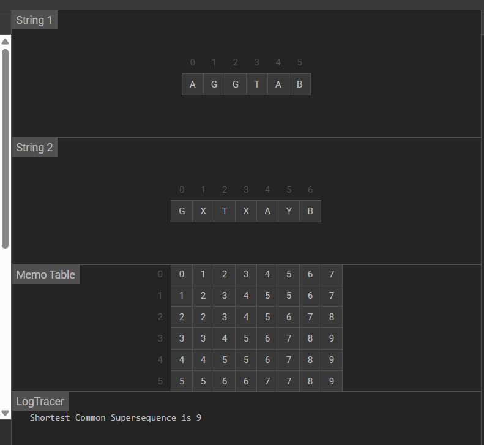

# 🚀 **Minimizing Cost in Shortest Common Supersequence (SCS)**

## 📌 Overview

In data compression and genome sequencing, constructing a sequence that contains two input sequences as subsequences with minimum length is vital. The **Shortest Common Supersequence** problem finds this sequence, balancing cost and data completeness.

---

## 🧠 Application

Google applies SCS in DNA alignment, text merge, and autocomplete suggestions where minimal combined sequences enhance efficiency and relevance.

| Metric             | Value          | Description                                             |
|--------------------|----------------|---------------------------------------------------------|
| ⏳ Time Complexity  | `O(m × n)`     | *m* and *n* are the lengths of the two input sequences  |
| 🧠 Space Complexity | `O(m × n)`     | DP table storing intermediate supersequence lengths     |

---

## 📊 Visual Representation

The Shortest Common Supersequence (SCS) uses a Dynamic Programming table similar to LCS, but includes both matched and unmatched characters.

  

<figcaption style="text-align: center; font-style: italic;">
  Figure: Dynamic Programming table showing the shortest common supersequence path.
</figcaption>

---

## 🧑‍💻 Code Reference

👉 [Shortest Common Supersequence Implementation](https://github.com/Shreshta001/aps_portfolio.github.io/blob/main/codes/10.cpp)

---

## 🌐 Real-World Use Cases at Google

| Feature               | Impact                                                |
|-----------------------|-------------------------------------------------------|
| 🧬 DNA Sequence Alignment | Efficient genome data comparison                      |
| 📄 Text Merging        | Combining text edits or autocomplete suggestion merging |
| ⚡ Data Compression    | Reducing storage by minimizing sequence redundancy     |

---

## 📚 References

- Dynamic Programming for Shortest Common Supersequence  
- Genome Sequencing Algorithms  
- [Wikipedia: Shortest Common Supersequence](https://en.wikipedia.org/wiki/Shortest_common_supersequence_problem)

---

## **[⏭Next](./11.md)**
