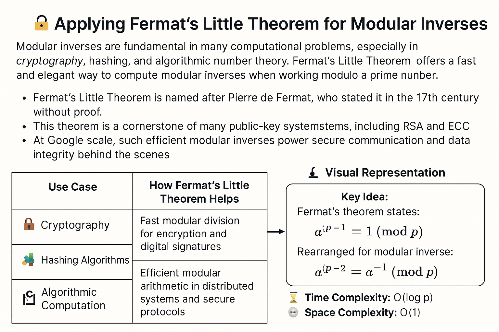

# 🔐 **Applying Fermat's Little Theorem for Modular Inverses**

Modular inverses are fundamental in many computational problems, especially in **cryptography**, **hashing**, and **algorithmic number theory**. Fermat's Little Theorem offers a fast and elegant way to compute modular inverses when working modulo a **prime number**.

- Fermat’s Little Theorem is named after Pierre de Fermat, who stated it in the 17th century without proof.  
- This theorem is a cornerstone of many public-key cryptosystems, including RSA and ECC.  
- At Google scale, such efficient modular inverses power secure communication and data integrity behind the scenes.

---

## 🌐 Application in Google Systems

Google leverages Fermat’s Little Theorem in critical areas such as:

| Use Case                   | How Fermat’s Little Theorem Helps                                   |
|---------------------------|--------------------------------------------------------------------|
| 🔒 **Cryptography**         | Fast modular division for encryption and digital signatures       |
| 🧩 **Hashing Algorithms**   | Computing inverses in rolling hashes to speed up substring searches|
| 🧮 **Algorithmic Computation** | Efficient modular arithmetic in distributed systems and secure protocols |

---

## 📐 Visual Representation

  

<figcaption style="text-align: center; font-style: italic;">
  Figure: Visualization of modular exponentiation cycles used in Fermat's Little Theorem
</figcaption>

 

- **Key Idea:**  
  Fermat’s theorem states: For a prime *p* and integer *a* (not divisible by *p*),  
  > a^(p−1) ≡ 1 (mod p)  
  Rearranged for modular inverse:  
  > a^(p−2) ≡ a^(-1) (mod p)  

---

## ⚙️ Algorithmic Insight

To compute the modular inverse of *a* modulo prime *p*, compute:

> `inverse = a^(p-2) mod p`

This is efficiently done using **fast exponentiation** (also called binary exponentiation or exponentiation by squaring).

### 📈 Complexity

| Metric             | Value        | Description                                        |
|--------------------|--------------|--------------------------------------------------|
| ⏳ Time Complexity  | `O(log p)`   | Fast exponentiation halves exponent each step    |
| 🧠 Space Complexity | `O(1)`       | Uses a few variables, constant extra space        |

---

## 🧑‍💻 Code Reference

👉 [Fermat's Little Theorem Modular Inverse Implementation](https://github.com/Shreshta001/aps_portfolio.github.io/blob/main/codes/15.cpp)

---

## 📚 References

- Ireland, K. & Rosen, M., *A Classical Introduction to Modern Number Theory*  
- [Wikipedia: Fermat's Little Theorem](https://en.wikipedia.org/wiki/Fermat%27s_little_theorem)  
- Google Research on Cryptographic Primitives  

---

## **[⏭️ Next](./16.md)**
