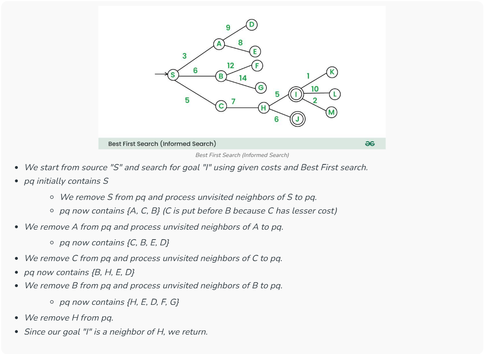

# 🔎 **Best First Search: Navigating Smarter Paths**

Best First Search is like having a smart guide on a journey — it uses **heuristics** (educated guesses) to prioritize the most promising paths first. This approach helps algorithms find efficient routes without blindly exploring every possibility.

At Google, this heuristic-driven pathfinding is fundamental in powering:

- 🗺️ **Google Maps navigation and real-time rerouting**  
- 🤖 **AI decision-making in robotics and self-driving cars**  
- 🔍 **Search result ranking with relevance scoring**  

---

## 📐 Algorithm Insight

Best First Search explores nodes based on heuristic estimates of distance or cost to the goal. It keeps track of nodes to explore using a **priority queue**, always expanding the most promising node next.

| Step                   | Description                                  |
|------------------------|----------------------------------------------|
| Initialize frontier     | Start with the initial node in a priority queue ordered by heuristic cost |
| Expand nodes           | Remove the best candidate and explore neighbors |
| Update frontier        | Add neighbors with their heuristic scores   |
| Repeat                 | Until the goal is reached or no nodes left   |

---

## ⚙️ Algorithm Characteristics

| Metric             | Value              | Explanation                                                                 |
|--------------------|--------------------|-----------------------------------------------------------------------------|
| ⏳ Time Complexity  | `O(b^m)`           | `b` = branching factor, `m` = max depth; depends heavily on heuristic quality |
| 🧠 Space Complexity | `O(b^m)`           | Frontier and visited nodes stored in memory                                 |

---

## 📊 Visualization

  

<figcaption style="text-align: center; font-style: italic;">
  Best First Search explores the graph guided by heuristic scores, prioritizing nodes closest to the goal.
</figcaption>

---

## 🧑‍💻 Code Reference

👉 [Best First Search Implementation](https://github.com/Shreshta001/aps_portfolio.github.io/blob/main/codes/19.cpp)

---

## 🌐 Real-World Google Applications & Unique Ideas

| Feature                      | How Best First Search Adds Value                           |
|------------------------------|-----------------------------------------------------------|
| 🗺️ **Google Maps & Navigation**       | Fast, heuristic-driven route optimization for live traffic and rerouting |
| 🤖 **Autonomous Systems**              | Enables robots and self-driving cars to make intelligent navigation choices |
| 🔍 **Search Result Ranking**           | Heuristics guide prioritization of highly relevant pages or snippets |
| ☁️ **Cloud Resource Management**       | Dynamic workload scheduling prioritizes critical tasks first for efficiency |
| 🎮 **Gaming & AR/VR**                  | AI opponents and virtual agents navigate complex worlds realistically |
| 📦 **Logistics & Delivery**            | Optimizes package routing based on changing traffic and weather conditions |
| 🧩 **Data Pipeline Optimization**     | Heuristic pathfinding reorders complex data processing workflows to save time |
| 📊 **Real-time Decision Making**       | Quickly adapts to new data or system states, improving user experience |

*Best First Search’s power lies in its flexibility — anytime you have a “best guess” to guide a search or decision, this approach helps you cut through noise efficiently.*

---

## 📚 References

- Russell, S., & Norvig, P. *Artificial Intelligence: A Modern Approach*  
- [Wikipedia: Best-first Search](https://en.wikipedia.org/wiki/Best-first_search)  
- Google AI Blog: Heuristic Search and Navigation in Real World Applications  

---

## **[⏭️ Next](./20.md)**
